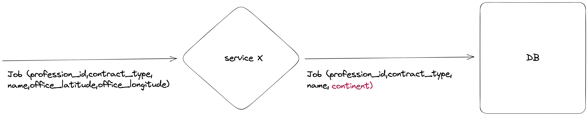

# Scaling

# Context

Let's imagine that we have 100,000,000 jobs and we have 1000 new jobs per second. How can the result be displayed in real time?

# Current solution

- For the moment the code is very simple since it reads/parse the CSV files and transform the data each time it is requested.
- The greater the volume of data, the longer it will take to retrieve results. Indeed there is too much coupling between the reading of the data, its transformation and its rendering.
- The use of CSV files for storing data is not ideal since it requires meticulous data parsing and validation.

# Solution considered

## Caching results

I first thought of caching the results. Indeed, it would be possible for the application to read this cache rather than the CSV files and simply display the results.

The problem with this solution is that the real time is not respected. Indeed, the results displayed would always be outdated. Even if the cache is refreshed every 30 seconds, I think we need to change the way the data are stored since the CSV files would
not scale.

# Solution selected

In my opinion, the best would be to store ready-to-use data in a suitable database (MySQL for example).

This solution seems basic, but I think it is possible to keep a very simple code, but on the other hand take full advantage of the computing power of a database.

In order to take full advantage of the database and the power of SQL, it is important that the data is ready for use.
By this, I mean that we do not have to do heavy processing in memory (such as calculating the continents from the coordinates).

## Processing

It would therefore process the data before adding it to the database. At first I would go on a dedicated service that would be able to insert 1000 jobs per second.
This service would take jobs (as listed in the CSV file), transform the data and insert them in database.



The data would then be strongly typed, clean and ready to use. No need to validate it when reading.

We would then end up with a properly formatted job list containing the profession category (easily retrieved using a foreign key) and the continents.

## SQL

Using an SQL query, we would easily be able to process the data.

Imagine that we have two well-filled tables:

_The following queries are very simplified for the example. It would be necessary to think about the use of indexes (for example) in order to improve the readings._

```sql
CREATE TABLE professions (
  id INT NOT NULL AUTO_INCREMENT,
  name VARCHAR(255) NOT NULL,
  PRIMARY KEY (id)
);
```

```sql
CREATE TABLE jobs (
  id INT NOT NULL AUTO_INCREMENT,
  profession_id INT NOT NULL,
  continent VARCHAR(255) NOT NULL,
  PRIMARY KEY (id),
  FOREIGN KEY (profession_id) REFERENCES professions(id)
);
```

We could then imagine a SQL query like this to produce a result close to the expected.

```sql
SELECT
    p.name AS profession_name,
    j.continent,
    COUNT(*) AS job_count,
    SUM(COUNT(*)) OVER(PARTITION BY p.name) AS profession_total_jobs,
    SUM(COUNT(*)) OVER(PARTITION BY j.continent) AS continent_total_jobs,
    SUM(COUNT(*)) OVER() AS total_jobs
FROM
    professions p
    INNER JOIN jobs j ON p.id = j.profession_id
GROUP BY
    p.name, j.continent
ORDER BY
    p.name, j.continent;
```

Example of result:

| profession_name | continent | job_count | profession_total_jobs | continent_total_jobs | total_jobs |
| --------------- | --------- | --------- | --------------------- | -------------------- | ---------- |
| Business        | europe    | 2         | 2                     | 10                   | 14         |
| RH              | europe    | 2         | 2                     | 10                   | 14         |
| Tech            | australia | 4         | 10                    | 4                    | 14         |
| Tech            | europe    | 6         | 10                    | 10                   | 14         |

I think this first step would greatly solve our performance concerns at first.

## Testing

Before moving on a too complex solution, it would be necessary to do performance tests and optimize (if necessary) the database using caches.

I would also suggest testing several different types of databases.

For example, columnar databases (Redshift for example) make it possible to solve problems on a very large amount of data (the storage would have to be reviewed, but that would be another possible solution).
